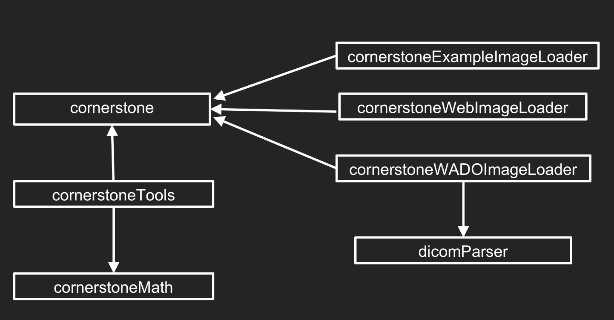
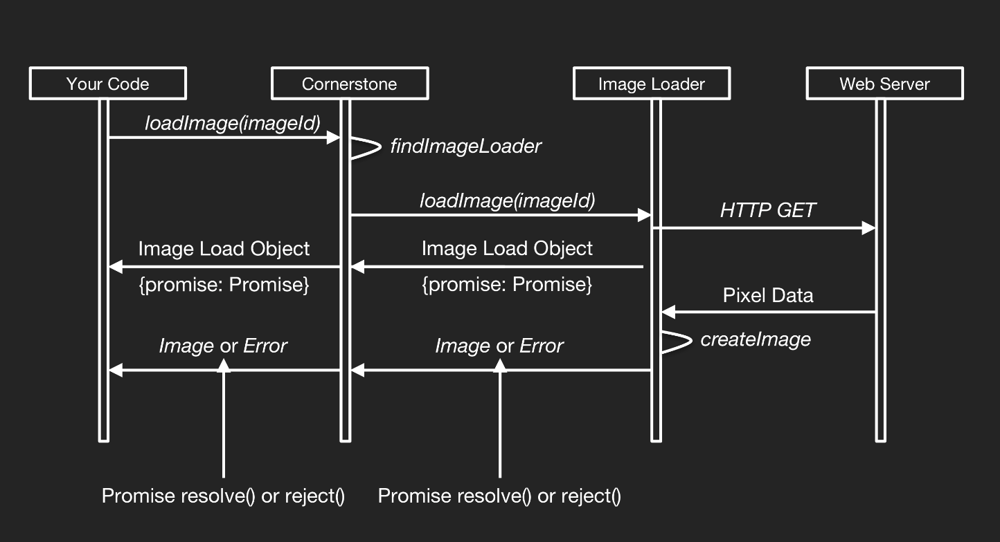

# Cornerstone 介绍

---

### Cornerstone 介绍

Cornerstone 是一个开源项目，目标是交付一个完整的基于 web 的医学成像平台。它提供了模块化的库，可以一起使用，也可以单独使用。

Cornerstone 生态系统的核心是 Cornerstone Core 库，通常简称为 Cornerstone。这个库处理图像呈现管道、加载、缓存和视口转换。

除了核心库之外，基础开发团队还支持其他几个库，它们为开发复杂的成像应用程序提供了生态系统。  

| Library | Description |
| --- | --- |
| Cornerstone Core | 提供图像呈现、加载、缓存和视口转换的中心库 |
| Cornerstone Tools | 对构建工具的可扩展支持，对鼠标、键盘和触摸设备的支持。 |
| Cornerstone WADO Image Loader | 用于 DICOM 第 10 部分文件的图像加载程序 |
| Cornerstone Web Image Loader | Image Loader for Web Image files (PNG, JPEG) |
| Cornerstone Math | 用于 Web 图像文件的图像加载程序(PNG, JPEG) |
| dicomParser | dicom 转换 |

### Image Loaders

Image Loader 是一个 JavaScript 函数，负责获取图像的 Image Id，并将相应的图像加载对象返回给 Cornerstone。图像加载对象包含一个解析生成图像的 Promise。

由于加载图像通常需要调用服务器，所以用于图像加载的 API 需要是异步的。Cornerstone 要求图像加载器返回一个包含 Promise 的对象，Cornerstone 将使用该 Promise 来异步接收图像对象，如果出现 Promise，则返回一个错误。

#### Image Loader Workflow

 

1. imageloader 注册自己的 Cornerstone，以加载特定的 ImageId URL 方案
2. 应用程序请求使用 loadImage() api 加载图像。
3. Cornerstone 将加载图像的请求委托给 ImageLoader，后者使用传递给 loadImage()的 imageId 的 URL 方案注册。
4. ImageLoader 将返回一个图像加载对象，其中包含一个 Promise，它将解决与相应的图像对象一旦获得像素数据。获取像素数据可能需要使用 XMLHttpRequest 调用远程服务器，对像素数据进行解压缩(如 JPEG 2000)，并将像素数据转换为 Cornerstone 理解的格式(如 RGB vs YBR 颜色)。
5. 然后使用 displayImage() API 显示解析 Promise 传递回来的图像对象。

虽然像素数据通常是从服务器获得的，但情况并不总是如此。实际的例子实际上使用了一个 ImageLoader 插件来提供图像，而根本不需要服务器。在本例中，图像是 base64 编码的，并存储在 ImageLoader 插件本身中。该插件只是将 base64 像素数据转换为像素数组。或者，可以编写一个在客户端生成派生映像的映像加载程序。例如，您可以通过这种方式实现 MPR 功能。

```js
function loadImage(imageId) {
  // Parse the imageId and return a usable URL (logic omitted)
  const url = parseImageId(imageId)

  // Create a new Promise
  const promise = new Promise((resolve, reject) => {
    // Inside the Promise Constructor, make
    // the request for the DICOM data
    const oReq = new XMLHttpRequest()
    oReq.open('get', url, true)
    oReq.responseType = 'arraybuffer'
    oReq.onreadystatechange = function(oEvent) {
      if (oReq.readyState === 4) {
        if (oReq.status == 200) {
          // Request succeeded, Create an image object (logic omitted)
          const image = createImageObject(oReq.response)

          // Return the image object by resolving the Promise
          resolve(image)
        } else {
          // An error occurred, return an object containing the error by
          // rejecting the Promise
          reject(new Error(oReq.statusText))
        }
      }
    }

    oReq.send()
  })

  // Return an object containing the Promise to cornerstone so it can setup callbacks to be
  // invoked asynchronously for the success/resolve and failure/reject scenarios.
  return {
    promise
  }
}
```

<!-- ::: demo

```html
<template>
  <div>
    <Breadcrumb></Breadcrumb>
  </div>
</template>
<script>
  export default {
    data() {
      return {}
    }
  }
</script>
```

::: -->
